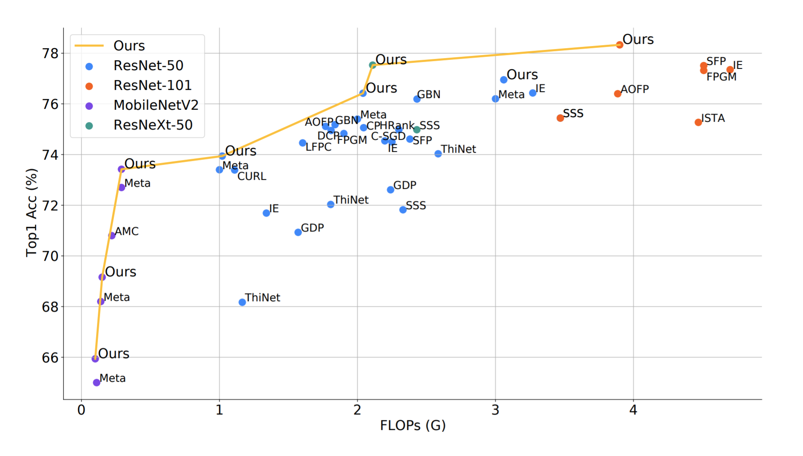
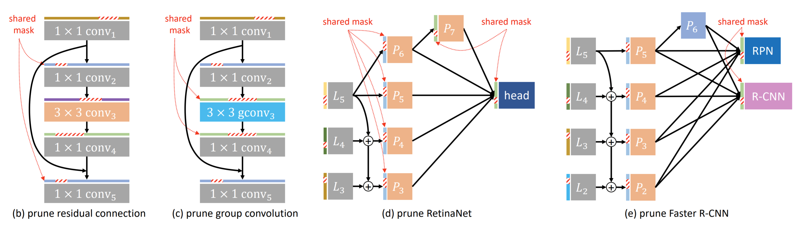
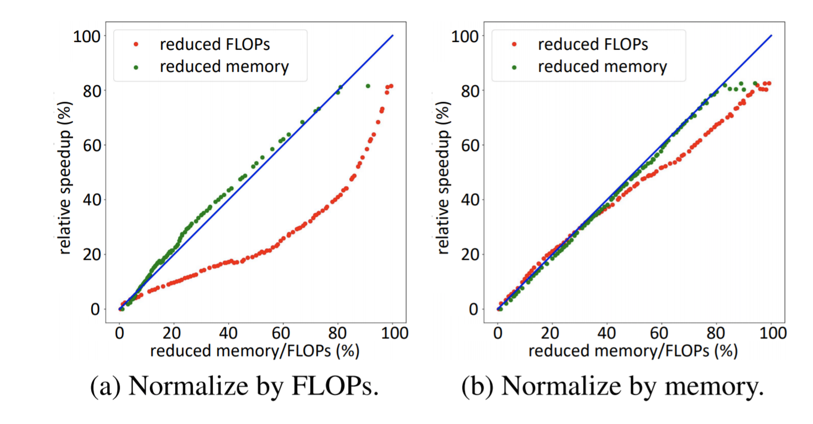

## [Group Fisher Pruning for Practical Network Compression (ICML2021)](./resources/paper.pdf)

By Liyang Liu\*, Shilong Zhang\*, Zhanghui Kuang, Jing-Hao Xue, Aojun Zhou, Xinjiang Wang, Yimin Chen, Wenming Yang, Qingmin Liao, Wayne Zhang

## Updates

* All one stage models of Detection has been released (21/6/2021)

## NOTES
All models about detection has been released. The classification models will be released later, because we want to refactor all our code into a [Hook](https://github.com/open-mmlab/mmcv/blob/master/mmcv/runner/hooks/hook.py) , so that it can become a more general tool for **all tasks in [OpenMMLab](https://github.com/open-mmlab)**.

We will continue to improve this method and apply it to more other tasks, such as segmentation and pose.

The layer grouping algorithm is implemtated based on the `AutoGrad`  of Pytorch, If you are not familiar with this feature and you can read Chinese, then these materials may be helpful to you.

1. [AutoGrad in Pytorch](https://jshilong.github.io/files/torch_autograd.pdf)

2. [Hook of MMCV](https://zhuanlan.zhihu.com/p/355272220)

## Introduction

#### 1. Compare with state-of-the-arts.

<div align="center">
  
</div>

####  2. Can be applied to various complicated structures and various tasks.

<div align="center">
  
</div>


#### 3. Boosting inference speed on GPU under same flops.

<div align="center">
  
</div>

## Get Started
#### 1. Creat a basic environment with pytorch 1.3.0  and mmcv-full

#### Due to the frequent changes of the autograd interface, we only guarantee the code works well in `pytorch==1.3.0`.


1. Creat the environment
```shell
conda create -n open-mmlab python=3.7 -y
conda activate open-mmlab
```
2. Install PyTorch 1.3.0 and corresponding torchvision.
```shell
conda install pytorch=1.3.0 cudatoolkit=10.0 torchvision=0.2.2 -c pytorch
```
3.  Build the ``mmcv-full`` from source with pytorch 1.3.0 and cuda 10.0
#### Please use gcc-5.4 and nvcc 10.0
```shell
 git clone https://github.com/open-mmlab/mmcv.git
 cd mmcv
 MMCV_WITH_OPS=1 pip install -e .
```

#### 2. Install the corresponding codebase in [OpenMMLab](https://github.com/open-mmlab).

e.g. [MMdetection](https://github.com/open-mmlab/mmdetection)

```shell
pip install mmdet==2.13.0
```

#### 3. Pruning the model.

e.g. Detection

```shell
cd detection
```

Modify the `load_from` as the path to the baseline model in  of `xxxx_pruning.py`

```shell
# for slurm train
sh tools/slurm_train.sh PATITION_NAME JOB_NAME configs/retina/retina_pruning.py work_dir
# for slurm_test
sh tools/slurm_test.sh PATITION_NAME JOB_NAME configs/retina/retina_pruning.py PATH_CKPT --eval bbox
# for torch.dist
# sh tools/dist_train.sh configs/retina/retina_pruning.py 8
```

#### 4. Finetune the model.

e.g. Detection

```shell
cd detection
```

Modify the `deploy_from` as the path to the pruned model in `custom_hooks` of `xxxx_finetune.py`

```shell
# for slurm train
sh tools/slurm_train.sh PATITION_NAME JOB_NAME configs/retina/retina_finetune.py work_dir
# for slurm test
sh tools/slurm_test.sh PATITION_NAME JOB_NAME configs/retina/retina_fintune.py PATH_CKPT --eval bbox
# for torch.dist
# sh tools/dist_train.sh configs/retina/retina_finetune.py 8
```

## Models

#### Detection

|  Method   | Backbone | Baseline(mAP) | Finetuned(mAP) | Download                                                     |
| :-------: | :------: | :-----------: | :------------: | ------------------------------------------------------------ |
| RetinaNet | R-50-FPN |     36.5      |      36.5      | [Baseline](https://download.openmmlab.com/mmdetection/v2.0/retinanet/retinanet_r50_fpn_1x_coco/retinanet_r50_fpn_1x_coco_20200130-c2398f9e.pth)/[Pruned](https://drive.google.com/file/d/1P_wa2RRGmelGKUL1MsCVcCW-Yg4PDyP2/view?usp=sharing)/[Finetuned](https://drive.google.com/file/d/1kpTno7iGwSB4iLmXVIBBRVZO1oAi7Kkm/view?usp=sharing) |
|   ATSS*   | R-50-FPN |     38.1      |      37.9      | [Baseline](https://drive.google.com/file/d/1wUgrQoYjNd2W4jelByNwKRH-rEgPDNHm/view?usp=sharing)/[Pruned](https://drive.google.com/file/d/1mf6tCENf6I8lcv29EMwwkezMGrqFh_WO/view?usp=sharing)/[Finetuned](https://drive.google.com/file/d/1b6hECGigMdqFV-c0wUg_gRROBRZuY83L/view?usp=sharing) |
|   PAA*    | R-50-FPN |     39.0      |      39.4      | [Baseline](https://drive.google.com/file/d/1iSrqUvu3dF2310c17ZXo-q6vgEx9dhtK/view?usp=sharing)/[Pruned](https://drive.google.com/file/d/1xZ2EghYDv_H-geoQtumVSv4dlCT8E8nc/view?usp=sharing)/[Finetuned](https://drive.google.com/file/d/1NGdk2DuAAOYJC7UFsmKFGkjb-bnODvXQ/view?usp=sharing) |
|   FSAF    | R-50-FPN |     37.4      |      37.4      | [Baseline](https://download.openmmlab.com/mmdetection/v2.0/fsaf/fsaf_r50_fpn_1x_coco/fsaf_r50_fpn_1x_coco-94ccc51f.pth)/[Pruned](https://drive.google.com/file/d/1w2w032T3argHT4j5MwujR9w-oIdRwPAf/view?usp=share_link)/[Finetuned](https://drive.google.com/file/d/1SAPT0ZoUmSu7EPSTcKeg9P9dO3wHNMs8/view?usp=sharing) |

\* indicate with no Group Normalization in heads.

#### Classification

Coming soon.

### Please cite our paper in your publications if it helps your research.

```
@InProceedings{liu2021group,
  title = {Group Fisher Pruning for Practical Network Compression},
  author =       {Liu, Liyang and Zhang, Shilong and Kuang, Zhanghui and Zhou, Aojun and Xue, Jing-Hao and Wang, Xinjiang and Chen, Yimin and Yang, Wenming and Liao, Qingmin and Zhang, Wayne},
  booktitle = {Proceedings of the 38th International Conference on Machine Learning},
  year = {2021},
  series = {Proceedings of Machine Learning Research},
  month = {18--24 Jul},
  publisher ={PMLR},
}
```
